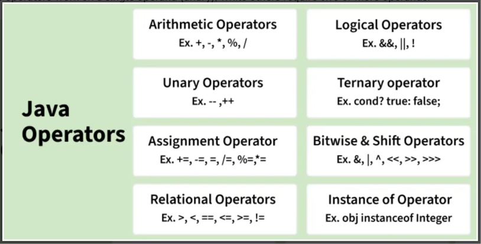

# Java Operators

Java operators are symbols used to perform operations on variables and values. They play a key role in expressions, calculations, and decision-making in programs. Operators help simplify complex logic into concise statements.

* They follow a defined precedence and associativity to determine execution order.
* Some operators work on a single operand (unary), while others require two or more operands.



## 1. Arithmetic Operators :
Arithmetic Operators are used to perform arithmetic operations on primitive numeric data types such as int, float, and double.

```
Enter first value: 5
Enter second value: 2
Enter 1 for addition, 2 for subtraction, 3 for multiplication, 4 for division, 5 for quotient :5
Quotient:1
```

## 2. Unary Operators:
Unary Operators need only one operand. They are used to increment, decrement, or negate a value.
## Example:
```
Post-increment : 6
Pre-increment : 8
Post-decrement : 5
Pre-decrement : 3
```

## Explanation:

* Unary operators work on a single operand (a and b).
* Post-increment (a++) returns the value first, then increments it.
* Pre-increment (++a) increments first, then returns the updated value.
* Same behavior applies to decrement operators (--).*

## 3. Assignment Operator:
The assignment operator assigns a value from the right-hand side to a variable on the left. Since it has right-to-left associativity, the right-hand value must be declared or constant. 

```
Initial: 10
After +5: 15
After *2: 30
After -5: 25
After /2: 12
After %3: 0
```

## Explanation:

* The variable num starts with an initial value of 10 and is updated step by step.
* Compound operators like +=, *=, -=, /=, %= perform operation and assignment together.
* Each statement changes the same variable, so the result depends on the previous step.
* The output shows how the value of num changes after each operation.

## 4. Relational Operators:
Relational Operators are used to check for relations like equality, greater than, and less than. They return boolean results after the comparison and are extensively used in looping statements as well as conditional if-else statements.  
```
a > b: true
a < b: false
a >= b: true
a <= b: false
a == c: false
a != c: true
```

## Explanation:

* Variables a, b, and c are compared using relational operators.
* Operators like >, <, >=, <=, ==, != return boolean values.
* These comparisons help in decision-making (if-else, loops).
* Each expression prints either true or false based on the condition.

## 5. Logical Operators:
Logical Operators are used to perform "logical AND" and "logical OR" operations, similar to AND gate and OR gate in digital electronics. They have a short-circuiting effect, meaning the second condition is not evaluated if the first is false.

```
x && y: false
x || y: true
!x: false
Eligible for vote
```

## Explanation:

* Boolean variables x and y are used to perform logical operations.
* && (AND) returns true only if both conditions are true.
* || (OR) returns true if at least one condition is true.
* ! (NOT) reverses the boolean value.

## 6. Ternary operator:
The Ternary Operator is a shorthand version of the if-else statement. It has three operands and hence the name Ternary. The general format is,

```Max of three numbers = 30```

## Explanation:

* The ternary operator is used as a shortcut for if-else conditions.
* It evaluates multiple conditions to find the maximum among three numbers.
* Syntax: (condition) ? value1 : value2.
* Nested ternary operators are used here for compact decision-making.* 

## 7. Bitwise Operators
These operators perform operations at the bit level.

* Bitwise Operators manipulate individual bits using AND, OR, XOR, and NOT.
* Shift Operators move bits to the left or right, effectively multiplying or dividing by powers of two.

```
d & e : 8
d | e : 14
d ^ e : 6
~d : -11
d << 2 : 40
e >> 1 : 6
e >>> 1 : 6
```

## Explanation:

* Binary values d and e are used to perform bit-level operations.
* Operators like &, |, ^, ~ manipulate individual bits.
* Shift operators (<<, >>, >>>) move bits left or right.
* These operations are useful in low-level programming and optimizations.

# In Java, arithmetic operators have the following precedence (highest to lowest):

| Precedence                  | Operators           | Description                                           | Associativity |
| --------------------------- | ------------------- | ----------------------------------------------------- | ------------- |
| 1 (Highest)                 | `++` `--` (postfix) | Post-increment, Post-decrement                        | Left to Right |
| 2                           | `++` `--` `+` `-`   | Pre-increment, Pre-decrement, Unary plus, Unary minus | Right to Left |
| 3                           | `*` `/` `%`         | Multiplication, Division, Modulus                     | Left to Right |
| 4                           | `+` `-`             | Addition, Subtraction                                 | Left to Right |
| 5 (Lowest among arithmetic) | `=`                 | Assignment                                            | Right to Left |
